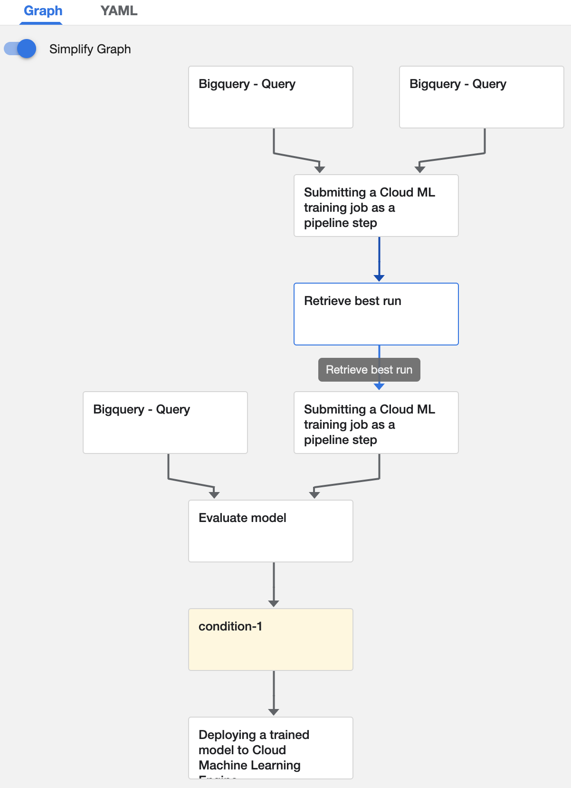

# MLops-on-GCP
This repo contains the process of implementing a Kubeflow Pipelines (KFP) in GCP.

Firstly, we develop, package as a docker image, and run on AI Platform Training a training application that builds a scikit-learn classifier. We code the steps of the machine learning workflow that will be orchestrated by the continuous training pipeline.

After that, we deploy and run a Kubeflow Pipeline (KFP) that automates ML workflow steps.

{ width: 200px; }
